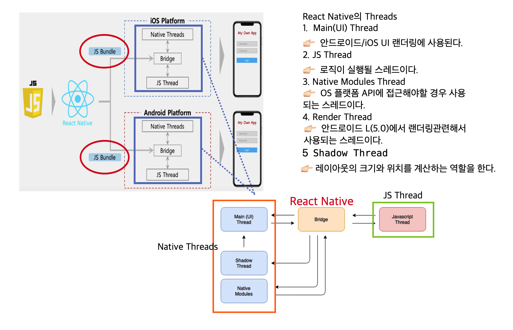

# React Native(RN) Basic

> RN의 기본에 대해서 알아보자 😜

## 개괄 : 앱 개발 방법

`네이티브 앱 개발 :`

기본적으로 각각의 모바일 기기(모바일 OS)에 맞춰진 언어로 개발이 가능하다.

- 안드로이드 : **자바** / **코틀린**
- iOS : **오브젝트-C** / **스위프트**

`크로스 플랫폼을 이용한 앱 개발 :`

`리액트 네이티브`는 자바스크립트를 사용하는 `크로스 플랫폼`으로서 <u>한가지의 언어로 안드로이드와 iOS에서 돌아가는 앱</u>을 모두 구현이 가능하다.

> 요즘에 급부상하고 있는 플러터(Flutter) 역시 크로스 플랫폼 앱 개발 프레임 워크로서 다트(Dart)언어를 사용한다. 👉🏻 [공식 사이트](https://flutter-ko.dev/)

## 리액트 네이티브의 작동 원리

> 리액트 네이티브는 자바스크립트 코드를 각각의 OS 플랫폼에 타겟팅해주는 역할을 한다.

`Low level Explanation(기계적 관점에서의 설명):`

1. 리액트 네이티브에서 앱을 빌드할 때 **전체 로직**을 가지고 있는 `JS Bundle`을 생성한다.

2. JS Bundle을 앱에 로딩하는 것은 `JS Thread`에 의해서 실행된다.

3. 각각의 OS에서 앱을 실행하기 위해선 `Native Thread`가 필요하다. 하지만 Native Thread와 JS Thread는 직접 상호작용이 불가능하다.(Native Thread와 JS Thread는 `독립적`이다.)

4. 이를 가능하게 해주는 것이 리액트 네이티브이다. 리액트 네이티브는 `둘을 연결해주는 브릿지` 역할이다.

## JS Bundle을 생성하는 방법

### 1. Expo CLI

`장점 :`

- 개발환경의 구축이 용이하여 처음 시작하기가 좋다.
- Expo에서 제공해주는 모듈이 다양하다.

`단점 :`

- OS Layer와 직접적인 상호작용이 불가능하다.(자바, 코틀린, 스위프트,오브젝트C 로 추가작성 불가능)
- Expo에서 제공해주는 것만 사용이 가능하다는 점은 개발관점에서 자유도가 많이 떨어진다.

### 2. React Native CLI

`장점 :`

- Expo로는 접근이 불가능한 Native기능에 접근이 가능하다.
- Expo를 사용하는 것보다 자유도가 높다. - OS Layer와 직접적인 상호작용이 가능하다.

`단점 :`

- 초기 앱 개발 환경 설정 및 초기 셋팅과정에 시간이 많이 소요된다.

## 프로젝트 생성 및 Simulator 구동

### 프로젝트 생성 명령어

> [공식사이트 : Creating a new application part](https://reactnative.dev/docs/environment-setup)

- `react native init [--version 0.65:버전정도] [프로젝트명/위치]`

  or

- `npx react-native init [프로젝트명/위치]`

### iOS 시뮬레이터 구동

- `npm start`
- `react-native run-ios`
- `react-native run-ios --simulator="iPhone 8 Plus"`

  > 다른 기기에서 시뮬레이터를 실행시켜보고 싶을 때, 기기의 이름을 넣어주면 된다.

- 시뮬레이터 단축키
  - `command + r` : refresh
  - `command + d` : debug menu
  - 디버그 메뉴창에서 <u>enable fast fresh를 클릭</u>하면 수동적인 리로드 없이 작업한 내용이 바로 시뮬레이터에 반영된다. 반대로 <u>disable fast fresh를 클릭</u>하면 refrech를 해줘야 작업한 내용이 반영이 된다.

### Android 시뮬레이터 구동

- 시뮬레이터를 먼저 구동하고 App을 실행시킨다.(iOS의 경우는 App을 실행하면 시뮬레이터가 자동으로 실행된다.)
- `npm start`
- `react-native run-android`
- 시뮬레이터 단축키
  - `double r` : refresh
  - `command / ctrl + m` or `shake device` : debug menu

## React Native 중요개념 정리

### Core Components & APIs

### Style을 주는 방법

1. inline style
2. StyleSheet.create({})

## React Navigation

> 리액트 네이티브에서의 화면전환을 하기 위해서는 third party 라이브러리인 리액트 네비게이션이 꼭 필요하다. 화면 전환의 방법에 따라서 아래와 같이 3가지로 구분된다.

> [React Navigation](https://reactnavigation.org/) : 설치 관련 내용은 공식사이트 참조

### Stack Navigation : `react-native-stack`

> 4가지 기본개념

1. CreateStackNavigator
2. RouteConfigs
3. StackNavigationConfig
4. navigationOptions

> 설치 패키지

- react-native-gesture-handler : 모바일 환경이기 때문에 터치 인터페이스를 로드해주는 패키지
- react-navigation
- react-navigation-stack

>

### Tab Navigation : `react-navigation-tab`

> 3가지 tab library

1. createBottomTabNavigator : 화면 하단에 위치
2. createMaterialBottomTabNavigator : 화면 하단에 위치, 기존의 createBottomTabNavigator 보다 더 많은 스타일링 기능 구현 가능
3. createMaterialTopTabNavigator : 화면 상단에 위치

### Drawer Navigation

## Miniprojects

> 만들면서 공부하잣!! 🚀 (~~projects 는 아니고 samples 나 examples~~)

|  #  |   Contents    |
| :-: | :-----------: |
| 01  |    Counter    |
| 02  | UpDown Number |

# Ref

`Main:`

- [React Native - Basic 강의](https://www.inflearn.com/course/%EB%A6%AC%EC%95%A1%ED%8A%B8-%EB%84%A4%EC%9D%B4%ED%8B%B0%EB%B8%8C-%EA%B8%B0%EC%B4%88)

- [ReactNative Tutorials](https://jeffgukang.github.io/react-native-tutorial/)

- [ReactNative 튜토리얼](https://g6ling.gitbooks.io/react-native-tutorial-korean/content/)

- [스무디 한 잔 마시며 끝내는 React Native - 책](http://www.yes24.com/Product/Goods/82895471?OzSrank=4)

 

`React Native의 작동원리 관련:`

- [잠깐…내가 만든 리액트 네이티브 앱이 시작하면 무슨일이 일어나는거지? — 리액트 네이티브 안을 들여다보기](https://medium.com/@kyo504/%EB%B2%88%EC%97%AD-%EC%9E%A0%EA%B9%90-%EB%82%B4%EA%B0%80-%EB%A7%8C%EB%93%A0-%EB%A6%AC%EC%95%A1%ED%8A%B8-%EB%84%A4%EC%9D%B4%ED%8B%B0%EB%B8%8C-%EC%95%B1%EC%9D%B4-%EC%8B%9C%EC%9E%91%ED%95%98%EB%A9%B4-%EB%AC%B4%EC%8A%A8%EC%9D%BC%EC%9D%B4-%EC%9D%BC%EC%96%B4%EB%82%98%EB%8A%94%EA%B1%B0%EC%A7%80-%EB%A6%AC%EC%95%A1%ED%8A%B8-%EB%84%A4%EC%9D%B4%ED%8B%B0%EB%B8%8C-%EC%95%88%EC%9D%84-%EB%93%A4%EC%97%AC%EB%8B%A4%EB%B3%B4%EA%B8%B0-2b4a9bce79a2)

- [React Native 이론](https://evanjin.dev/development/react-native-%EC%B0%B8%EA%B3%A0%EC%82%AC%ED%95%AD%EB%93%A4/#react-native-%EC%9D%B4%EB%A1%A0)

- [React Native는 어떻게 작동합니까?](http://www.devh.kr/2020/How-React-Native-Works/)
